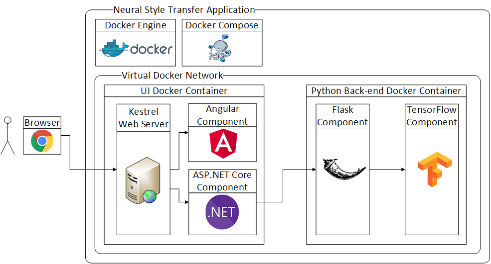

*How to extend NST with a second style and what are the challenges of deploying it as a single unit using TensorFlow, Flask, ASP.NET Core, Angular and Docker Compose.*

<p style="text-align: right; font-style: italic">Programming is easy like riding a bike. Except the bike is on fire and you're on fire and everything is on fire and you're actually in hell.</p>


*The picture is generated by the application under discussion, its content is taken from [Jeff Atwood](https://blog.codinghorror.com/on-the-meaning-of-coding-horror/) who took it from Steve McConnell's book, Code Complete.*

>A live demo is available at <http://nst-online.evgeniymamchenko.com>.

>The sources are available at <https://gitlab.com/OutSorcerer/NeuralStyleTransferWeb>. You will also find the instructions how to launch the application locally with Docker Compose. 

* TOC
{:toc}

## How to use the application

* Click on the "Content Image" button or the placeholder below and upload a content image.

* Pick a style image.

* Optionally pick a second style image.

* Optionally change the parameters.

    * Iterations. The number of optimization steps taken. The higher the number, the lower the cost and, generally, the more beautiful the result.

    * Content cost weight. The multiplier of the content cost term in the total cost. The higher the number, the more similar to the content image the result is. 

    * Style cost weight. The multiplier of the style cost term in the total cost. The higher the number, the more similar to the style image the result is. 

* Click "Launch" button. The transfer is starting, the resulting image and other transfer details are shown on the screen.

    <a href="../images/nst-ui.png" style="height: 50%; width: 50%"></a>

    *This is how the UI looks in the middle of a style transfer when **two** styles (a starry sky and neon lights) are simultaneously applied to a single content image.*

    >Please note that <http://nst-online.evgeniymamchenko.com> works just on 2-cores machine, where 100 iterations of transfer take about 30 minutes. My mobile GPU Nvidia GeForce GTX 1050 works about *100 times* faster. Unfortunately, a GPU in the cloud is too expensive right now (one of the cheapest GPU instances with Nvidia TESLA K80 Module costs about $700 per month, which gives the total price of the module in just half a year, I guess we should thank the Blockchain Bubble for that and for the wasted non-renewable energy resources, but let's hope it will be a benefit for the development of GPU hardware in the long term).

    If your job status is "queued" that means that the back-end is busy at the moment but it will start processing your input as soon as all previous jobs are done.

* Click "Stop" button to abort the transfer.

## What is Neural Style Transfer?

Intuitively it can be defined as generating a picture which content is similar to one input image and which style is similar to another input image.

In a more detailed way, it is a result of iterative optimization of a specific cost function defined on a resulting image. On each step of the optimization, we compute the gradient of that cost function with respect to each pixel of resulting image and slightly change the resulting image in the direction opposite to the gradient as we always do in the [Gradient descent algorithm](https://en.wikipedia.org/wiki/Gradient_descent).

The interesting fact here is that typically with convolution neural networks images are fixed and weights of the network are the subject of optimization. On the contrary, in NST algorithm the weights of CNN are fixed while the input image is optimized. In [the original paper](https://arxiv.org/abs/1508.06576) the CNN with [VGG architecture](https://www.quora.com/What-is-the-VGG-neural-network) pre-trained on [ImageNet dataset](https://en.wikipedia.org/wiki/ImageNet). This application also loads weights of pre-trained VGG model. What is interesting is [there could be something special in VGG architecture that makes it especially good for Neural Style Transfer](https://www.reddit.com/r/MachineLearning/comments/7rrrk3/d_eat_your_vggtables_or_why_does_neural_style/) although some people achieved good results with other architectures too.

The mentioned cost function is a sum of two terms.

The first one is the content cost multiplied by its weight (a parameter that can be configured in UI as mentioned above). The content cost is the squared Euclidean distance between (the squared L2-norm of the difference of) the values of an intermediate convolution layer on the content image and the resulting image normalized by the input size. 

The second one is thereafter the style cost multiplied by the style cost weight parameter. 

Unlike the content cost, the style cost is computed on multiple layers which are summed up with their weights which are also model parameters. In the context of this application, there are five such layers, each weight is equal to 0.2 and cannot be changed from the UI yet. The shallower layers are responsible for lower-level features like those  that detect horizontal lines, vertical lines, diagonal lines and other simple geometrical shapes, while deeper layers are responsible for higher-level features like those that detect parts of objects or entire objects like eyes, flowers, cars, cats and dogs, although sometimes it is pretty hard to figure out what a particular feature detects.

For a single layer, the style cost is the squared Euclidean distance between [Gram matrices](https://en.wikipedia.org/wiki/Gramian_matrix) of that layer activations (with `(number_of_channels, height*width)` shape) for the resulting image and the style image.

Gram matrix is approximately proportional to the covariance matrix (in case values are centered). Its diagonal elements are just squared L2 norms of the corresponding channel activations reshaped as one-dimensional vectors.

For a detailed explanation of Neural Style Transfer you can [see the original paper](https://arxiv.org/abs/1508.06576), read [my source code](https://gitlab.com/OutSorcerer/NeuralStyleTransferWeb) or [watch the video and complete the corresponding programming assignment](https://www.coursera.org/learn/convolutional-neural-networks/home/week/4) from the CNN course on Coursera on which my code is based on (all videos are available for free [on YouTube](https://www.youtube.com/watch?v=Re2C9INXCNc&index=38&list=PLBAGcD3siRDjBU8sKRk0zX9pMz9qeVxud) but Coursera subscription is required to complete the programming assignment).

## How the original Neural Style Transfer algorithm was extended

To make the application more interesting, I decided to extend the original algorithm somehow. What if we try to apply two styles simultaneously? Surprisingly, it worked quite well: styles are not overlapping but rather applied to different parts of the image depending on which part is more suitable for each style. Let us call it "dual NST".

See [the example illustration above](#dual-nst-image).

To implement a second style an extra style term is added to the total cost.

Feel free to play with it yourself, I would appreciate if you would share your results in comments.

## Architecture



Let us talk in more detail about the building blocks of the application.

### Angular 5

[Angular 5](https://angular.io/) component is the face of the application. It is responsible for validating a user input and sending it to the server.

When a transfer job is in progress, it does polling with a one-second interval to show results in real time. [rxjs](https://angular.io/guide/rx-library) is a nice tool for filtering, mapping and combining streams of asynchronous events where tasks like HTTP polling are solved in a powerful and concise way. For example, if some request was not able to complete in one second and the next request already started it makes no sense to wait for both of them and waste connections as the data from the previous request are already obsolete. [switchMap](https://www.learnrxjs.io/operators/transformation/switchmap.html) operator nicely solves this problem:

```typescript
const polling = Observable.timer(0, 1000)
    .switchMap(() => this.http.get<any>(this.baseUrl + `api/neural-style-transfer/jobs/${jobId}`));
```

Angular 5 is my framework of choice because of my love to statically typed languages like C# or TypeScript and also because of [the nice SPA template](#usage-of-server-side-rendering-and-angular-5-from-net) included with .NET Core CLI. That template is even capable of the [server-side rendering](https://angular.io/guide/universal) which is a nice tool for SEO and the user experience as it significantly decreases the initial page load time.

The template (and this application) uses [Bootstrap](https://getbootstrap.com/) library which looks a bit old-fashioned in 2018, I hope the next template from Microsoft will use [Angular Material](https://material.angular.io/) which is more modern-looking.

Considering React vs. Angular, I prefer Angular because, among other things, it is a whole framework with "batteries included" experience with things like built-in [Dependency Injection](https://angular.io/guide/dependency-injection) that could be very useful for tests. So you have fewer decisions to make in the beginning, while it is still highly extendable (for example, if you would like, you could use Redux-like [@ngrx/store](https://github.com/ngrx/platform/tree/master/docs/store)).

### ASP.NET Core

The [ASP.NET Core](https://github.com/aspnet/Home) component receives REST requests from the Angular SPA, resizes images to 400x300 and puts NST jobs in a queue. Since TensorFlow uses 100% of CPU power, it is not practical to perform two transfers simultaneously, that is why that queue comes in handy. The ASP.NET Core component is also responsible for responding to the polling from the Angular SPA and doing the polling of Python back-end itself.

C# is my favorite language so the choice of ASP.NET Core is natural for me. Microsoft is doing a great job improving the C# language (comparing with Java, C# syntax recently [was](https://docs.microsoft.com/en-us/dotnet/csharp/whats-new/csharp-6) [and](https://docs.microsoft.com/en-us/dotnet/csharp/whats-new/csharp-7) [still](https://docs.microsoft.com/en-us/dotnet/csharp/whats-new/csharp-7-1) [is](https://docs.microsoft.com/en-us/dotnet/csharp/whats-new/csharp-7-2) [years](https://docs.microsoft.com/en-us/dotnet/csharp/whats-new/csharp-7-3) [ahead](http://www.dotnetcurry.com/csharp/1440/csharp-8-new-features)) and building great tools for the developer productivity like Visual Studio and VS Code (and, thanks to JetBrains there are also great extensions/alternatives like ReSharper or Rider). I admit that the open-source community around C# is not as productive as Java or Python communities, but considering that the framework itself and many Microsoft libraries became open-source and cross-platform and [Microsoft supports others in building open-source software based on .NET](https://dotnetfoundation.org/), everyone should take a closer look at .NET Core.

Also, using C# here is a nice example of how two micro-services written in different languages possibly by different teams could easily communicate using REST. Python is very popular for machine learning, but in other spheres, people may use Java, .NET, Node.js, etc. so such a scenario is what we would often see in the real world.

### Flask

[Flask](http://flask.pocoo.org/) is a popular Python framework for building Web APIs including RESTful ones. 

It wraps around the TensorFlow model which is running in a background thread while on another thread it responds to requests to start, stop or query a status of an NST job.

Even though there are special `flask_restful` and `flask_jsonpify` packages creating REST/JSON services seems to be not so smooth with Flask as it is with ASP.NET Core. I believe it is not only my lack of experience with it because some parts of my code are based on high-ranked answers on Stack Overflow and instead of using some built-in function they are suggesting to copy-paste their implementations of it.

To be more clear here is an example of parsing of an HTTP request body in JSON format:

```python
# This decorator takes the class/named tuple to convert any JSON data in incoming request to. 
def convert_input_to(class_):
    def wrap(f):
        def decorator(self, *args):
            obj = class_(**request.get_json())
            return f(self, obj)
        return decorator
    return wrap

@convert_input_to(BackendJobModel)
def put(self, job):
    # ...
    current_job = job
```

Looks nice, but what if a decorated function had more arguments? I could rewrite the code, of course, but the point is there should be a built-in and generic solution out-of-the-box on the contrary to making users copy-paste code that performs very basic tasks. 

For comparison the similar place in ASP.NET Core does not use any custom code and looks like this:

```csharp
[HttpPut("jobs")]
public ActionResult StartJob([FromBody] JobModel model)
{
    // ...
}
```

I would appreciate if someone would recommend me a nicer replacement of Flask for REST on Python.

### TensorFlow

[TensorFlow](https://www.tensorflow.org/) is an open-source software library for numerical computation using data flow graphs. It has a built-in gradient computation, many supported operations from simple matrix addition or multiplication to pre-implemented convolution or sampling layers, optimizers from `GradientDescentOptimizer` to `AdamOptimizer`, ability to run on GPUs and TPUs and many more which makes it one of the most popular tools for building neural network models.

The program starts with loading weights of the pre-trained VGG network and building a computational graph. A nice thing is that a single graph and a single TensorFlow session can be used for handling different user inputs which makes initialization time much faster.

Since initialization and training take significant time, but we want to keep a user up to date by responding to HTTP requests, TensorFlow code works in a separate thread. 

This code is based on an assignment *Art Generation with Neural Style Transfer* from Andrew's Ng [course](https://www.coursera.org/learn/convolutional-neural-networks), which is a part of [Deep Learning specialization](https://www.coursera.org/specializations/deep-learning).

My changes include the support for a second style image that I described [above](#how-the-original-neural-style-transfer-algorithm-was-extended) and various performance improvements that I am going to describe [below](#leaking-tensorflow-graph-nodes-and-therefore-memory).

### Docker Compose

[Docker](https://www.docker.com/) as a containerization software that provides an *immutable environment* which helps a lot with making deployment predictable and reducing time expenses for it. That is useful both for Python and .NET Core / Angular parts of the application. They are both wrapped into Docker containers.

[Docker Compose](https://docs.docker.com/compose/overview/) is, in turn, a tool to run multi-container applications. One of its abilities is virtual networks where we can put our services so that they are visible to each other, but not to outside world. In this example, the Python container should not communicate with a user directly so it does not publish any ports to outside and it can only receive requests from the .NET Core container, which, on the contrary, publishes port 80 to receive user requests.

With Docker and Docker Compose you can launch this application just in minutes without spending much time on environment preparation (which might be a tedious task). You will find the detailed instructions in the README file of [the corresponding GitLab repository](https://gitlab.com/OutSorcerer/NeuralStyleTransferWeb).

## Challenges

It was fun to work on this project. But, unfortunately sometimes your code fails, it could be not your guilt, but it is your responsibility to make everything work. There was plenty of moments when something was not working and I had no idea why, that is the reason I chose [Coding Horror illustration](#coding-horror-on-fire) for this post. But more satisfying it was to figure everything out finally.

### Installing TensorFlow with GPU support on Windows

TensorFlow itself installs easily [following their instructions](https://www.tensorflow.org/install/install_windows#requirements_to_run_tensorflow_with_gpu_support) with just `pip install`, but Nvidia could definitely try better with deploying their seriously great software to an end-user. 

[CUDA 9.0](https://developer.nvidia.com/cuda-90-download-archive) (with `tensorflow-gpu` 1.8.0 package you need exactly CUDA 9.0 version, not the most recent one) itself is wrapped in a nice installer, but unfortunately it fails to install Visual Studio integration module and does not even try to install other modules afterwards even though they do not depend on the VS integration.

Luckily, they have a forum where user *oregonduckman* posted his [workaround](https://devtalk.nvidia.com/default/topic/1033111/cuda-setup-and-installation/cuda-9-1-cannot-install-due-to-failed-visual-studio-integration/post/5259187/#5259187). I was even able to simplify it a bit and also [contributed](https://devtalk.nvidia.com/default/topic/1033111/cuda-setup-and-installation/cuda-9-1-cannot-install-due-to-failed-visual-studio-integration/post/5260927/#5260927) to that forum thread. The solution was surprisingly easy: install everything except VS integration, unzip installer file as an archive and manually launch executables in the VS integration folder. Another unobvious step is that you should **not** install the latest GPU driver, instead, you may need to remove existing Nvidia GPU driver by replacing it with a generic one prior to the CUDA installation. Also, see [the official installation instructions](https://docs.nvidia.com/cuda/cuda-installation-guide-microsoft-windows/index.html).

cuDNN installation is even more a shame since here [you have to copy some files manually](https://docs.nvidia.com/deeplearning/sdk/cudnn-install/#installwindows) from unzipped "installer" and manually set some environment variables.

I hope I live to see the day when NVidia finally makes a proper installer or maybe even start using a Windows package manager like [Chocolatey](https://chocolatey.org/).

Docker could help here a lot, but unfortunately using GPU from Docker [is not possible on Windows right now](https://github.com/NVIDIA/nvidia-docker/issues/197). Although I could imagine it working in a bright future as the answer why it is not possible looks promising: "No not possible, we would need GPU passthrough (i.e DDA) which is only available in Windows server 2016." If it works on Windows Server it could come to other editions of Windows as well.

### Communication between .NET Core and Python

My first approach to this was launching a Python process from .NET Core by [System.Diagnostics.Process.Start](https://docs.microsoft.com/en-us/dotnet/api/system.diagnostics.process.start). At first, it looked as a nice and simple while cross-platform way, but it had a number of disadvantages. 

How is .NET Core supposed to pass parameters and input images to Python? How should Python pass resulting images and costs to .NET Core? On Windows and Linux there are various ways of inter-process communication like named pipes or sockets, but they are not cross-platform. So initially I chose a common temporarily folder as a mean of communication. The .NET Core process was just placing input files there and passing transfer parameters like iterations count as command-line arguments to the Python process. The Python process, in turn, was writing result files in that folder and the .NET Core process was subscribing to changes in that folder with [FileSystemWatcher](https://docs.microsoft.com/en-us/dotnet/api/system.io.filesystemwatcher).

A big disadvantage was that 500Mb weights of the pre-trained VGG network were reloading from disk to memory for each transfer job. TensorFlow graph was also rebuilding from scratch each time. All that was resulting in initialization time of about one minute. 

The solution was to the make Python process long-running and communicate with it by REST with help of Flask framework. So the weights are now loaded just once, the graph is built just once and, as a result, the request initialization time on GPU went from one minute to thirty seconds.

Since the traffic between .NET Core and Python components is quite small (about 300 kB per second) HTTP/JSON is fine for this use-case. In case that would become a bottleneck something like [WebSocket](https://en.wikipedia.org/wiki/WebSocket) and a binary serialization protocol like [Protocol Buffers](https://en.wikipedia.org/wiki/Protocol_Buffers) could be used. Another alternative is Google's [gRPC](https://github.com/grpc/grpc).

### Usage of server-side rendering and Angular 5 from .NET

I [mentioned above](#angular-5) that I used a nice Angular 5 template for .NET Core. The issue is that in the current (2.0) version of .NET the CLI for .NET or Visual Studio this template is missing but there is the Angular 4 template instead. 

I foolishly tried to update it manually to Angular 5, that initially worked fine. But as soon as I started to build Docker images, that included building the Angular 5 application in production mode with SSR, it broke. It turned out that there were breaking changes in SSR from Angular 4 to Angular 5.

I was already choosing between giving up SSR or giving up Angular 5 when I luckily found that [Microsoft created the new SPA template](https://github.com/aspnet/JavaScriptServices/issues/1288#issuecomment-346003334) with the support of both Angular 5 and [SSR](https://docs.microsoft.com/en-us/aspnet/core/spa/angular?view=aspnetcore-2.1&tabs=visual-studio#server-side-rendering) (although SSR is *not* turned on by default). The point was that template was still in beta and it had to be installed manually with

```shell
dotnet new --install Microsoft.DotNet.Web.Spa.ProjectTemplates::2.0.0
```

and used by 

```shell
dotnet new angular
```

When .NET Core SDK 2.1 is released, that will not be required anymore.

### Leaking TensorFlow graph nodes (and therefore memory)

The original implementation of NST from [the Deep Learning specialization on Coursera](https://www.coursera.org/specializations/deep-learning) worked nicely when it was launched just once or twice from Jupiter notebook. But, as it turned out, it was not production-ready at all.

The first thing, that caught my eye, was that content cost and style cost nodes of the computation graph in TensorFlow were not reused but created for each input image:

```python
# a_C was a NumPy array (not a Tensor) with an activation of a hidden layer
#    when a network input is set to a content image
# a_G was also a NumPy array with the same activation 
#    when a resulting image is set as a network input
# J_content is the content cost tensor (a graph node in a computation graph)
J_content = compute_content_cost(a_C, a_G)
```

It was rewritten as:

```python
a_C_var = tf.Variable(np.zeros(out.shape), trainable = False, dtype = 'float32')
J_content = compute_content_cost(a_C_var, a_G)
```

The same was done for the style cost, the content cost weight, the style cost weight and the total cost.

That allowed to reuse their graph nodes just by assigning new values to the corresponding variables. That was done intuitively in the attempt to cache what can be cached considering that the initialization time at the moment was too long. That ended up to be a step in the right direction, but a serious problem still remained.

I also realized that a current session must not be created from scratch for each transfer but a single session can be reused.

Everything seemed to be perfect, I deployed the application to a Google Cloud instance and started to test it more intensively. And then I faced "out of memory" errors. At first, I thought that it is just a peculiarity of the Python/TensorFlow memory management and it can be solved just by increasing the instance memory but that just postponed the error, not fixed it entirely. I looked at the TensorFlow process memory consumption and saw that it was steadily growing.

Long story short, the reason was [leaking TensorFlow computation graph nodes, specifically assign nodes](https://github.com/tensorflow/tensorflow/issues/4151). 

Assign operation in TensorFlow is not like an assign operation from C++ or Python it is just another graph node. Using them to set variables to new inputs was adding new and new nodes to a graph that was causing "out of memory" errors.

More accurately, the assign operation itself is not consuming memory, but [it implicitly creates a constant node with an assigning value](https://github.com/tensorflow/tensorflow/issues/2311). 

By the way, there is a nice way to validate if you program is free of such kind of bugs, by adding `tf.get_default_graph().finalize()` immediately before the training loop. It is not done automatically just because [it would break a huge amount of existing code](https://github.com/tensorflow/tensorflow/issues/2311#issuecomment-219524374). But maybe it would be a good thing...

So, instead of:

```python
session.run(input_variable.assign(content_image))
```

there must be:

```python
input_placeholder = tf.placeholder(dtype='float32', shape=(1, CONFIG.IMAGE_HEIGHT, CONFIG.IMAGE_WIDTH, CONFIG.COLOR_CHANNELS)) 
graph['input'] = tf.Variable(input_placeholder, dtype = 'float32')
```

during initialization, and then for each request:

```python
session.run(input_variable.initializer, feed_dict = {input_placeholder: content_image})
```

You must also remove:

```python
session.run(tf.global_variables_initializer())
```

Because that would also try to initialize variables like `input_variable` without defining the corresponding placeholder values which would cause a error. Each variable must be initialized manually instead.

You will most likely also have to initialize the variables implicitly created by the optimizer. It can be done like:

```python
# The following line must be executed only once before the computation graph is finalized.
optimizer_variables_initializer = tf.variables_initializer(optimizer.variables())
# The following line should be executed for each transfer.
session.run(optimizer_variables_initializer)
```

That fix also sped up the application significantly. A second run with a GPU started to initialize just in few seconds instead of half a minute.

>Here is [a post on KDnuggets with more typical problems in TensorFlow graphs](https://www.kdnuggets.com/2017/05/how-not-program-tensorflow-graph.html).

### Broken switchMap

[switchMap](https://www.learnrxjs.io/operators/transformation/switchmap.html) is a nice operation except it does not work. When I opened network tab in Chrome debugging tools, I was shocked as I saw that requests were not cancelled when they were taking more than one second, instead they were running indefinitely and, what was even worse, they were piling up and, since Chrome executes just a limited number of requests, that meant that pending time for each new request was growing.

So why `switchMap` may not work? It is obvious, you just need to replace

```typescript
import { Observable } from "rxjs";
```

with

```typescript
import { Observable } from "rxjs/Observable";
```

and it starts to work. In exchange for that you now have to explicitly import every rxjs operator that was previously imported automatically like

```typescript
import 'rxjs/add/operator/switchMap';
```

Why it helps? I do not know, but the good thing [they fixed it in 6.0 version](https://github.com/ReactiveX/rxjs/issues/3306#issuecomment-374346659). Thanks to [Airblader](https://github.com/Airblader) who created a [GitHub issue](https://github.com/ReactiveX/rxjs/issues/3306) where I found this.

### Long response time

But why HTTP requests where taking so long for server to handle in the first place? Responses were just about 300 kB, so it was not the Internet speed.

The reason was that the TensorFlow thread was using 100% CPU, so there were not enough resources for the Flask thread and for the ASP.NET Core process.

Another consequence was [weird exceptions from ASP.NET Core application](https://github.com/aspnet/JavaScriptServices/issues/1514):

```
System.InvalidOperationException: The SPA default page middleware could not return the default page '/index.html' because it was not found,
and no other middleware handled the request.
Your application is running in Production mode, so make sure it has been published, or that you have built your SPA manually. Alternatively
you may wish to switch to the Development environment.

   at Microsoft.AspNetCore.SpaServices.SpaDefaultPageMiddleware.<>c__DisplayClass0_0.<Attach>b__1(HttpContext context, Func`1 next)
   at Microsoft.AspNetCore.Builder.RouterMiddleware.<Invoke>d__4.MoveNext()
--- End of stack trace from previous location where exception was thrown ---
```

Luckily Docker Compose file format has a solution for that:

```yaml
version: '2.3'

services:
    neural-style-transfer-ui:
        cpu_shares: 4096

    neural-style-transfer-backend:
        cpus: 1.9
        cpu_shares: 1024
```

`cpus` sets [the maximum number of cores](https://docs.docker.com/config/containers/resource_constraints/#configure-the-default-cfs-scheduler) that a service can occupy (in that case there was two-core instance).

`cpu_shares` sets [a weight of a service](https://docs.docker.com/config/containers/resource_constraints/#configure-the-default-cfs-scheduler), which takes effect only during the moments when CPU resources are limited.

I was confused at first by the fact that [those settings were removed in the version 3 of Compose file](https://docs.docker.com/compose/compose-file/compose-versioning/#version-3). The reason is that the version 3 is mainly for running stacks of containers in Docker Swarm, which has its own way of limiting CPU usage, while the version 2 is for good old Docker Compose. And [the version 2.3 is not so old as it was introduced almost at the same time as 3.4](https://github.com/docker/compose/issues/4513#issuecomment-377311337). 

To make it even easier for a server I started to send the resulting image only when it changes. On a two-core instance it happens once in about 15 seconds, and the image size is about 300 kB, while for the rest of polling responses, that are performed each second, payload size is just a few hundreds of bytes.

## Possible improvements and further reading

### Feed-forward Style Transfer

The Deep Learning field is developing incredibly fast, and the original Neural Style Transfer paper called [A Neural Algorithm of Artistic Style
](https://arxiv.org/abs/1508.06576) from September 2, 2015 already became obsolete in terms of the implementation details of the style transfer idea (while the idea itself is still actual, moreover, [it had a huge impact even outside of the scientific community](https://play.google.com/store/apps/details?id=com.neuralprisma)).

One major breakthrough was a following paper that introduced a fast feed-forward method of Neural Style Transfer, [Texture Networks: Feed-forward Synthesis of Textures and Stylized Images](https://arxiv.org/abs/1603.03417) from March 10, 2016. That method involves just a single forward propagation through a neural network instead of an iterative process and thus it is few orders of magnitude faster. The trade-off is that a network must be trained in advance for each style image and that process is even slower than the original style transfer iterative process. You can [try that algorithm online](https://demos.algorithmia.com/deep-style/).

Another paper that proposed a feed-forward method was [Perceptual Losses for Real-Time Style Transfer and Super-Resolution](https://arxiv.org/abs/1603.08155) from March 27, 2016. It looks like it is cited more often, but it appeared a bit later.

The next great discovery was a method of arbitrary style transfer that generalized the previous feed-forward approach to an arbitrary style in [ZM-Net: Real-time Zero-shot Image Manipulation Network](https://arxiv.org/abs/1703.07255) from March 21, 2017.

Other approaches to arbitrary style transfer are [Exploring the structure of a real-time, arbitrary neural artistic stylization network](https://arxiv.org/abs/1705.06830) from August 24, 2017 and [Universal Style Transfer via Feature Transforms](https://arxiv.org/abs/1705.08086) from November 17, 2017. 

See [a Medium post with an overview of the history of NST](https://medium.com/artists-and-machine-intelligence/neural-artistic-style-transfer-a-comprehensive-look-f54d8649c199).

So, the next step for my application could be the replacement of the current iterative implementation with a feed-forward one based on one of the previous papers. What could still be challenging is how to implement it with a second style.

### Arbitrary image size and proportions

The current implementation like the underlying VGG network can only process images of the fixed size (400x300), so if a chosen image size is different, it is resized by .NET Core application, before it is assigned as an input of a neural network.

In a [recent post on fast.ai](http://www.fast.ai/2018/04/30/dawnbench-fastai/) the author mentioned adaptive pooling layers, which could help to process an image of an arbitrary size (as far as I understand it is based on [Spatial Pyramid Pooling in Deep Convolutional Networks for Visual Recognition](https://arxiv.org/abs/1406.4729)). That would be useful for Neural Style Transfer too.

### Processing multiple user requests simultaneously

The bottleneck of the application is an optimization process in TensorFlow. Although multiple transfers are queued, the slow speed of a transfer on CPU makes it impractical on multi-user scenarios.

With GPU the performance is much better, but still, currently, only a single user at a time can have his transfer running, while others will wait in a queue. Running two TensorFlow sessions simultaneously [is not stable, most likely due to GPU memory allocation](https://github.com/tensorflow/tensorflow/issues/4196).

On my 2GB GPU an attempt to run two TensorFlow sessions from two Python processes results in the following error:

```
2018-06-03 00:15:43.736350: E T:\src\github\tensorflow\tensorflow\stream_executor\cuda\cuda_dnn.cc:455] could not create cudnn handle: CUDNN_STATUS_ALLOC_FAILED
2018-06-03 00:15:43.741649: E T:\src\github\tensorflow\tensorflow\stream_executor\cuda\cuda_dnn.cc:427] could not destroy cudnn handle: CUDNN_STATUS_BAD_PARAM
2018-06-03 00:15:43.747966: F T:\src\github\tensorflow\tensorflow\core\kernels\conv_ops.cc:713] Check failed: stream->parent()->GetConvolveAlgorithms( conv_parameters.ShouldIncludeWinogradNonfusedAlgo<T>(), &algorithms)
```

That could be solved by using multiple machines with multiple replicas of the Python Docker container. That would also require Docker Swarm, Kubernetes or another orchestrator that runs against a cluster instead of Docker Compose, which runs against a single machine.

An alternative solution is the usage of [distributed TensorFlow on a cluster](https://www.tensorflow.org/deploy/distributed).

### TensorFlow Serving

[TensorFlow Serving](https://www.tensorflow.org/serving/serving_basic) does not seem to be applicable currently, as it serves an already trained model, but here is a training process. However, with a feed-forward approach, it could replace the Flask part.

Moreover, [it can also serve multiple models on a single GPU simultaneously](https://github.com/tensorflow/serving/issues/335#issuecomment-305886225).

## Credits

Thanks to Andrew Ng and the whole [deeplearning.ai](https://www.deeplearning.ai/) and Coursera teams for their great work on the [Deep Learning specialization](https://www.coursera.org/specializations/deep-learning).

Thanks to [GitLab.com](https://gitlab.com/) for generously providing 10Gb repositories for free without limits on individual files sizes (unlike 100Mb limit for a single file size on GitHub).

Thanks to Google Cloud for their $300 / 12-month [Free Tier](https://cloud.google.com/free/) where the application is running now.
